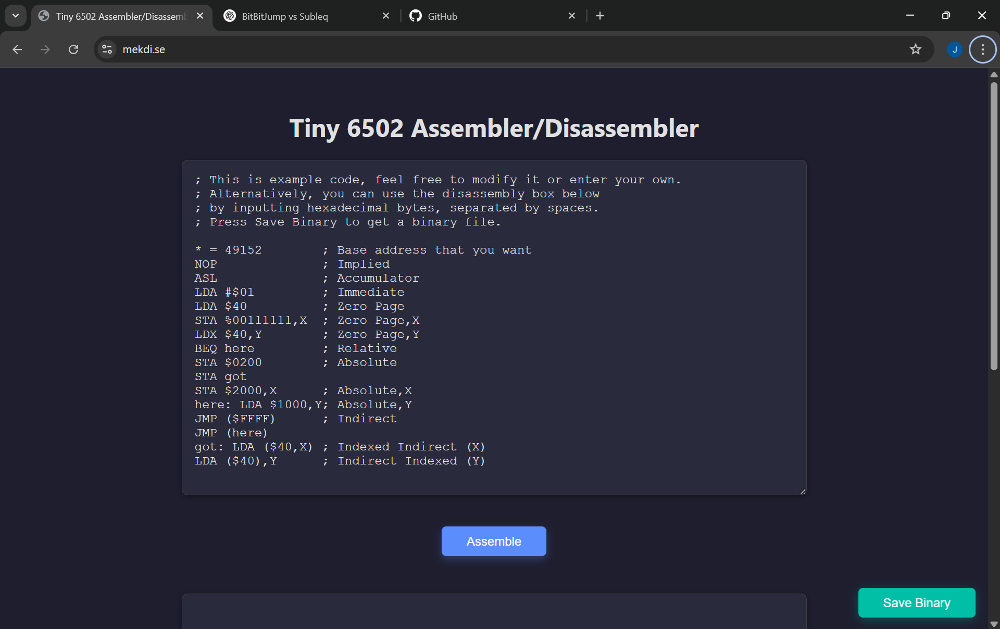

# Tiny 6502 Assembler/Disassembler

A tiny and minimal assembler and disassembler for the 6502 microprocessor, written in JavaScript.
It simply converts 6502 mnemonics into machine code and vice versa.
Right now, it's somewhere between a machine code monitor and a fully fledged assembler.
It's designed for educational purposes, experimenting, retro computing enthusiasts, and small projects involving 6502-based systems.
 
## Features

- Assemble 6502 assembly code into binary machine code
- Disassemble 6502 machine code into readable assembly
- Supports the full standard 6502 instruction set
- Case-insensitive parsing of instructions and directives
- Supports labels
- Supports comments
- Supports decimal, hexadecimal, and binary number formats for values and addresses
- Lightweight and easy to use
- Written in pure JavaScript, no external dependencies

> ⚠️ **Work in Progress:** This project is under active development and may contain bugs or incomplete features. Use with caution and feel free to contribute improvements or bug fixes.

## Known Issues

- Multiple `* = $xxxx` directives are not supported yet; only the first base address is respected. Using multiple base address resets may cause incorrect assembly or disassembly.

## Screenshot

Below is a screenshot demonstrating the assembler in use:

## Resources

These resources were useful during development and might help you understand or extend this project:

- [Comprehensive 6502 Instruction Reference](https://www.pagetable.com/c64ref/6502/) — A detailed and practical guide to the 6502 instruction set, addressing modes, and behavior.
